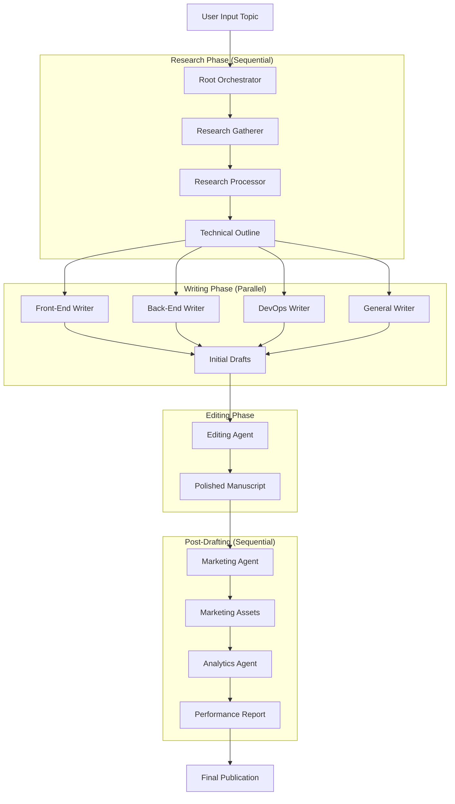

# Publishing Studio: Autonomous Multi-Agent Technical Publishing

Publishing Studio is a sophisticated multi-agent system built on the **Agent Developer Kit (ADK)**. It autonomously manages the entire lifecycle of technical book production—from initial market research and outlining to concurrent drafting, editing, marketing, and performance analytics.

## 🏗️ Architecture

The studio uses a hierarchical orchestration model with specialized agents for each stage of the publishing pipeline.



### 1. Root Orchestrator (`root_agent.yaml`)
The "Executive Editor" that coordinates the end-to-end workflow, delegating tasks to specialized phase agents and ensuring context flows seamlessly between them using an **Iterative Drafting Loop**.

### 2. Research Phase (`research_agent.yaml`)
A **Sequential Workflow** that separates information gathering from content architecture.
- **Research Gatherer**: Uses built-in search to identify market trends, competitors, and technical gaps.
- **Research Processor**: Transforms raw research into a structured technical Markdown outline in `research/outline.md`.

### 3. Writing Phase (`writing_phase.yaml`)
A **Parallel Workflow** that drafts multiple sections of the manuscript concurrently using specialized sub-agents:
- **Front-End Writer**: Focuses on UI/UX and user-facing documentation.
- **Back-End Writer**: Focuses on core logic, APIs, and implementation.
- **DevOps Writer**: Focuses on deployment, security, and CI/CD.
- **General Writer**: Handles introductions and conceptual chapters.

### 4. Editing Phase (`editing_agent.yaml`)
A specialized editorial agent that reviews drafts for clarity, style consistency, and technical accuracy.

### 5. Marketing & Analytics
- **Marketing Agent (`marketing_agent.yaml`)**: Generates launch plans and social media assets.
- **Analytics Agent (`analytics_agent.yaml`)**: Forecasts 6-month ROI and provides optimization recommendations.

## 🛠️ Tools & Integration

The system leverages custom tools defined in `agents/studio_tools.py` that enforce a secure boundary:

- `read_file`: Securely read data from the project `workspace/`.
- `write_file`: Persist research, drafts, and assets.
- `list_directory`: Navigate and verify files in the workspace.
- `execute_command`: Run builds or tests within the sandbox.

## 📁 Workspace Structure
All assets generated by the studio are saved in the `workspace/` directory:
- `research/`: Market analysis and the technical `outline.md`.
- `drafts/`: Raw manuscript chapters.
- `marketing/`: Launch strategies and social media hooks.
- `analytics/`: Sales forecasts and performance reports.

## 🚀 Getting Started

### Prerequisites
- Python 3.10+
- [Agent Developer Kit (ADK)](https://google.github.io/adk-docs/)
- Google Gemini API Key

### Installation
1. Clone the repository and install dependencies:
   ```bash
   pip install google-adk
   ```

### Usage
Run the studio using the ADK CLI or Web interface:
```bash
adk web
```

**Example Prompts:**
*   **Full Lifecycle**: `"I want to publish a technical book about 'Building AI Agents with ADK'. Run the full studio lifecycle."`
*   **Research Only**: `"Research the 'Rust for WebAssembly' market and generate a 10-chapter technical outline in research/outline.md."`
*   **Targeted Drafting**: `"Based on the existing research/outline.md, draft Chapter 1 and Chapter 2 using the writing sub-agents."`

## 🛡️ Sandbox Policy
All filesystem operations are strictly restricted to the `workspace/` directory to ensure security and prevent unauthorized system access during the autonomous drafting process.
