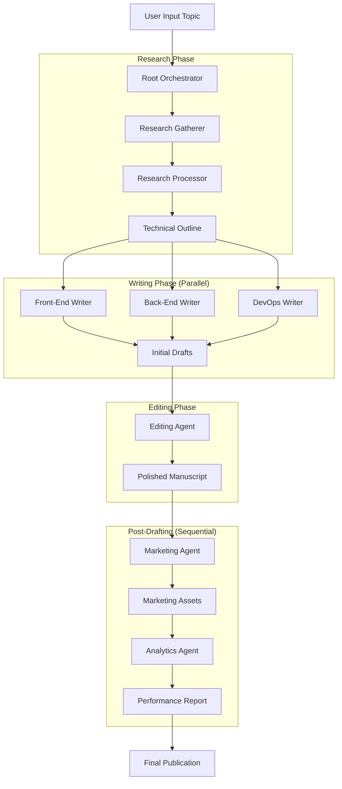

# Publishing Studio: Autonomous Multi-Agent Technical Publishing

Publishing Studio is a sophisticated multi-agent system built on the **Agent Developer Kit (ADK)**. it autonomously manages the entire lifecycle of technical book production—from initial market research and outlining to concurrent drafting, editing, marketing, and performance analytics.

## 🏗️ Architecture

The studio uses a hierarchical orchestration model with specialized agents for each stage of the publishing pipeline.



### 1. Root Orchestrator (`root_agent.yaml`)

The "Executive Editor" that coordinates the end-to-end workflow, delegating tasks to specialized phase agents and ensuring context flows seamlessly between them.

### 2. Research Phase (`research_agent.yaml`)

A **Sequential Workflow** that separates information gathering from content architecture.

- **Research Gatherer**: Uses `google_search` to identify market trends, competitors, and technical gaps.
- **Research Processor**: Transforms raw research into a structured technical Markdown outline.

### 3. Writing Phase (`writing_phase.yaml`)

A **Parallel Workflow** that drafts multiple sections of the manuscript concurrently.

- **Front-End Writer**: Focuses on UI/UX, introductory chapters, and user-facing docs.
- **Back-End Writer**: Focuses on core logic, APIs, and database implementation.
- **DevOps Writer**: Focuses on deployment, security, and CI/CD.

### 4. Editing Phase (`editing_agent.yaml`)

A specialized editorial agent that reviews drafts for clarity, style consistency, and technical accuracy, polishing the final manuscript.

### 5. Marketing Phase (`marketing_agent.yaml`)

A **Sequential Workflow** for launch strategy.

- **Trend Researcher**: Identifies viral hooks and social media trends.
- **Marketing Strategist**: Generates a 5-day launch plan, blog posts, and high-conversion ad copy.

### 6. Analytics Phase (`analytics_agent.yaml`)

A **Sequential Workflow** for performance forecasting.

- **Stats Gatherer**: Researches current sales metrics and platform trends.
- **Performance Analyst**: Forecasts 6-month ROI and provides optimization recommendations.

## 🛠️ Tools & Integration

The system leverages custom tools defined in `agents/studio_tools.py`:

- `read_file`: Securely read data from the project workspace.
- `write_file`: Persist research, drafts, and assets.
- `execute_command`: Run builds or tests within the sandbox.
- `google_search`: Built-in search for real-time market intelligence.

## 🚀 Getting Started

### Prerequisites

- Python 3.10+
- [Agent Developer Kit (ADK)](https://google.github.io/adk-docs/)
- Google Gemini API Key

### Installation

1. Clone the repository:

   ```bash
   git clone <repository-url>
   cd publishing-studio
   ```

2. Install dependencies:

   ```bash
   pip install google-adk
   ```

### Usage

Run the studio using the ADK CLI:

Example prompt : "Research the 'Building AI Agents with ADK' market and draft a 5-chapter book."

```bash
adk run agents
```

## 🛡️ Sandbox Policy

All filesystem operations are strictly restricted to the `workspace/` directory to ensure security and prevent unauthorized system access during the autonomous drafting process.
